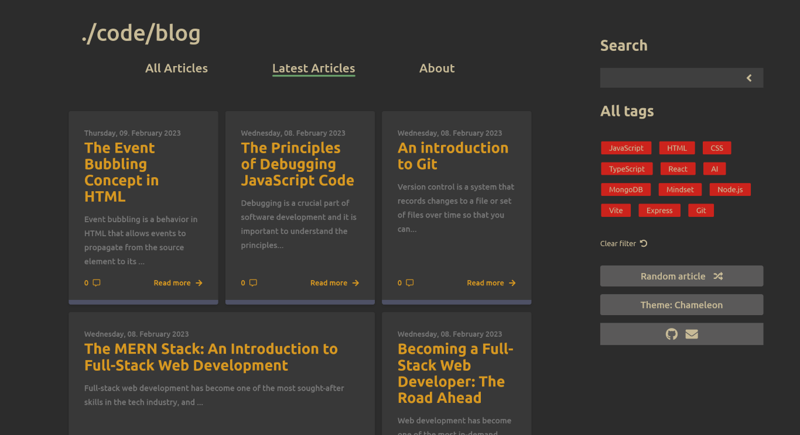
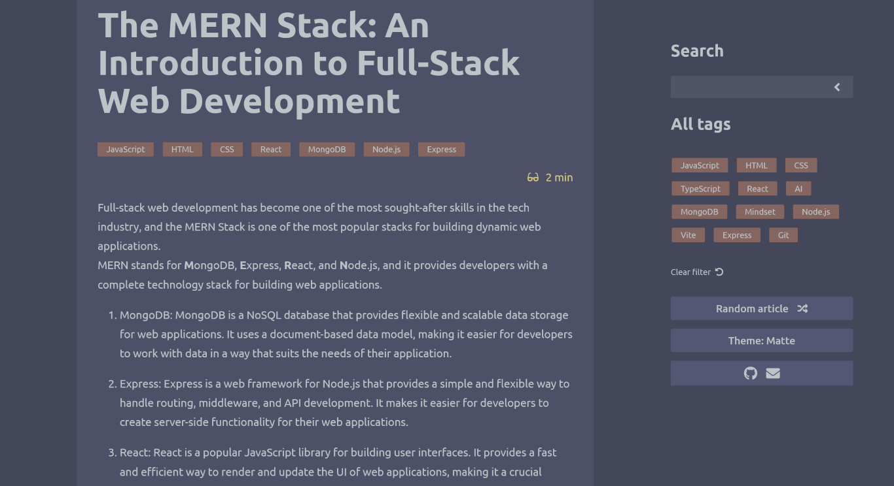
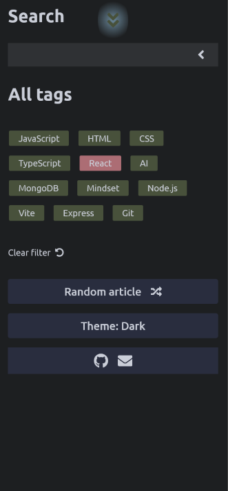

# Code-Blog

A blog client built with React and TypeScript that fetches data from a self-coded RESTful blog API built with Express.js.

## Live

[https://erynder-z.github.io/code-blog/](https://erynder-z.github.io/code-blog/)

## Features

- Text search
- Filtering articles by tag
- Five different themes
- Commenting on each article

## API

The blog client fetches data from a self-coded RESTful blog API. The source code for the API can be found at [https://github.com/erynder-z/code-blog-api](https://github.com/erynder-z/code-blog-api).

## Content Management System

The blog can be managed from a self-coded content management system. The source code for the CMS can be found at [https://github.com/erynder-z/code-blog-admin](https://github.com/erynder-z/code-blog-admin).

## Installation

1.  Clone the repository to your local machine: `git clone https://github.com/erynder-z/code-blog.git`
2.  Navigate to the project directory: `cd code-blog`
3.  Install the required dependencies: `npm install`
4.  Start the development server: `npm run dev`

## Acknowledgments

- [Date-fns](https://date-fns.org/) - A library for manipulating dates in JavaScript.
- [Html-entities](https://github.com/mdevils/node-html-entities) - A library for encoding and decoding HTML entities.
- [Html-react-parser](https://github.com/remarkablemark/html-react-parser) - A library for converting HTML strings into React components.
- [Prismjs](https://prismjs.com/) - A library for syntax highlighting in the browser.
- [React](https://reactjs.org/) - A JavaScript library for building user interfaces.
- [React-icons](https://github.com/react-icons/react-icons) - A library for adding icons to React projects.
- [React-loader-spinner](https://github.com/mhnpd/react-loader-spinner) - A library for adding a loading spinner to React projects.
- [React-router-dom](https://github.com/ReactTraining/react-router/tree/master/packages/react-router-dom) - A library for routing in React projects.
- [String-strip-html](https://github.com/vkurchatkin/string-strip-html) - A library for stripping HTML tags from strings.
- [TypeScript](https://www.typescriptlang.org/) - A typed superset of JavaScript that compiles to plain JavaScript.
- [EsLint](https://eslint.org/) - A linter for JavaScript and TypeScript code.
- [Prettier](https://prettier.io/) - An opinionated code formatter for JavaScript and TypeScript code.
- [Vite](https://vite.dev/) - A fast build tool for JavaScript and TypeScript projects.

## Screenshots

### Desktop

### Mobile

